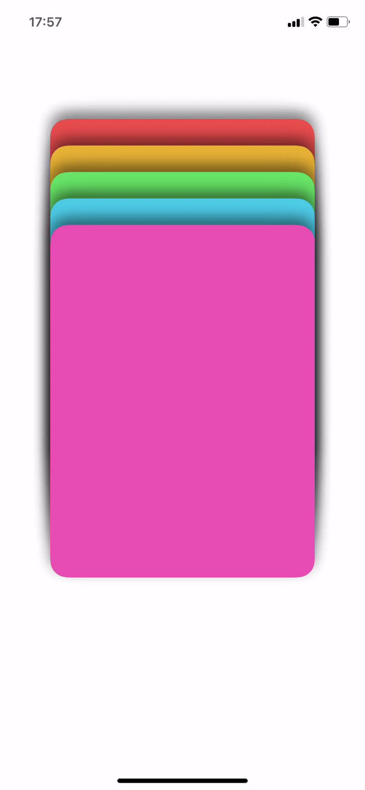

# CardStack SwiftUI

Interactive, draggable card stack view using SwiftUI, similar to interfaces seen in popular dating or flashcard apps.

## Demo

<p align="center"></p> 

## Features

*   Interactive card stack UI built entirely with SwiftUI.
*   Smooth drag gestures to move the top card around.
*   Swipe gesture (left/right/up/down) to dismiss the top card.
*   Clean animations for card movement and dismissal.
*   Dynamic stack effect showing underlying cards.

## How to Run

1.  Clone the repository:
    ```bash
    git clone https://github.com/mehran-khani/CardStack.git 
    cd CardStack
    ```
2.  Open `CardStack.xcodeproj` in Xcode.
3.  Select an iOS Simulator (e.g., iPhone 14 Pro) or connect a physical device.
4.  Press the Run button (Cmd+R).

